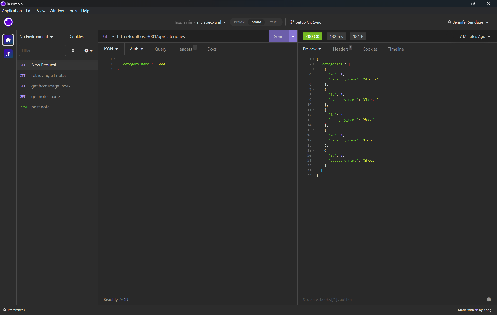

# Module-13-ORM-Ecommerce-product-database-management

## Description:
    This code allows database management of products using sequelize. 

## Table of Contents:
* [Installation](#installation)
* [Usage](#usage)
* [Credits](#credits)
* [License](#license)

## Installation
You need to install mysql2, express, express Router, and dotenv

## Usage
Navigate to the directory in the command line then run the schema.sql through mysql2, exit mysql and run npm run seeds to populate the database. Finally run node server.js to start the server. You can test endpoints in Insomnia or a similar app. 
## Credits

## License  

## Tests

## Questions

github repo:
https://github.com/jensandage1/Module-13-ORM-Ecommerce-product-database-management

 Video Showing Userability:
 https://watch.screencastify.com/v/gPr1tYaKRN5xu1ii4mOy

  